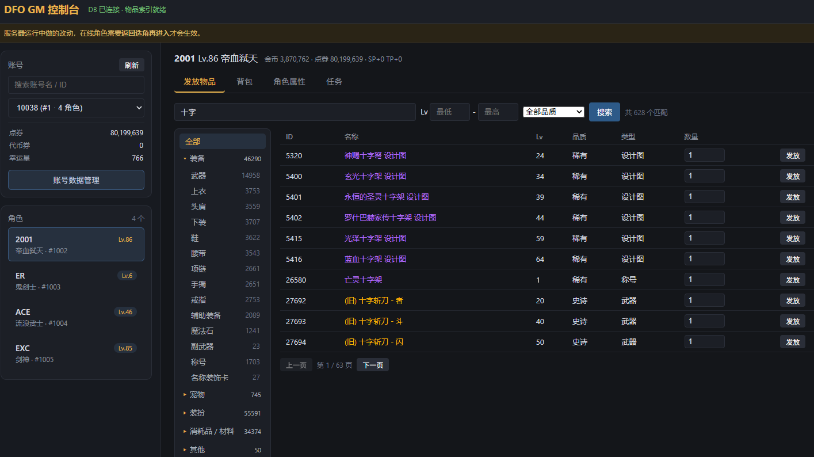
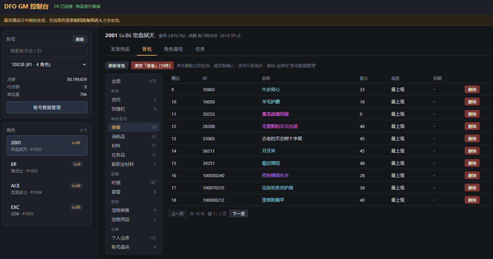
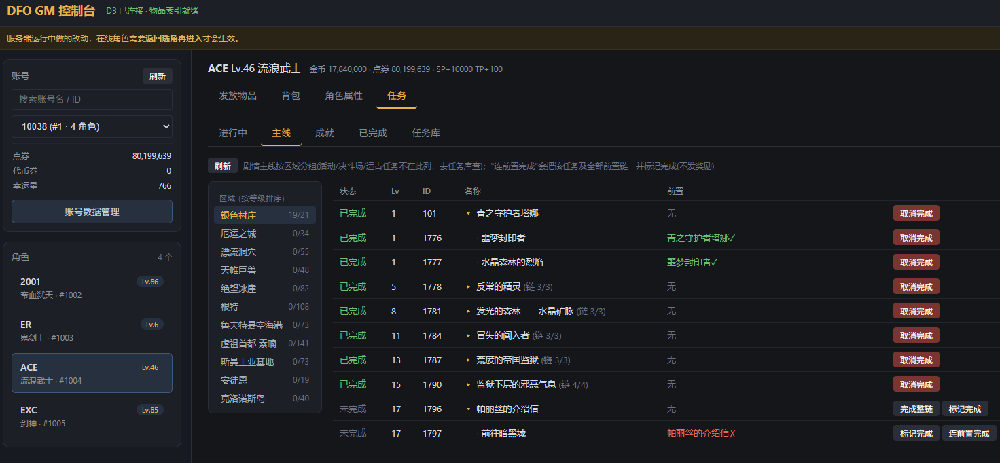

# DfoGmTool

S4A12 服务端的 Web GM 控制台。独立进程运行，直接操作服务端部署目录里的
`inventory.db` 和 `Script.pvf`；浏览器打开 `http://localhost:5050` 使用。

源码自包含：不依赖任何本地相邻仓库即可构建和发布（见「架构」）。

## 界面预览

**发放物品** — 分类树 + 关键词/等级/品质筛选，名称按品级着色：



**背包** — 按容器分类查看与管理：



**任务** — 区域任务链树与成就称号簿：



## 功能

**账号**
- 账号搜索：按账号名 / ID 过滤，也支持按角色名反查账号（选项里标注命中的角色）
- 账号数据管理：点券 / 代币券 / 幸运星 / 赛利亚幸运值直接覆写；六种晶块覆写；账号金库查看、单删、确认后一键清空

**角色**
- 等级设置（经验按阈值表写入，战斗属性同事务重算）
- 转职 / 觉醒覆写（下拉选择，按服务端同一套算法重算属性）
- SP / TP 查看（真实剩余/总量）与附加点调整
- 基础属性表（82 字节属性块全字段解码，翻译取自客户端串表）

**背包**
- 五组分类侧栏：常用（货币/快捷栏）、角色背包（装备/消耗品/材料/任务品/副职业材料/特殊材料/其他）、
  穿戴（穿戴装备/时装/徽章）、宠物（宠物/宠物装备/宠物用品）、仓库（个人仓库/账号金库/账号晶块）
- 金币 / 复活币 / 胜点在「货币」分类里直接覆写；单件删除立即生效；「清空分类」需确认
- 读取走服务端在线背包模型（InventoryService.LoadFromDb，不裸读多态列的数据库表）

**发放物品**
- 默认**经游戏内邮件发放**：物品落服务端邮箱表（`MailboxRepository.SendSystemMail`，82B ItemCore 附件 + 审计 + 幂等键），玩家在游戏邮箱里领取——**在线角色也能安全收**，不再有"直改 DB 被服务端内存覆盖"的冲突
- 请求带 `direct: true` 时退回旧的直写背包路径（仅离线角色维护用）
- 左侧分类树（可折叠）：装备按部位、宠物、装扮、消耗品/材料按背包同款六段（镜像服务端入格逻辑）
- 筛选：关键词 / ID + 等级区间 + 品质。品质 0-6 七档（普通/高级/稀有/神器/史诗/勇者/传说），
  另含三个数据驱动的细分档：稀有·魔法封印（`[random option]`）、稀有·传承（`[item category] legacy`）、
  神器·领主（`[item category] boss drop`）
- 装备通过邮件发送时可选择最上级或随机品级，以及普通强化、未净化或已净化增幅；
  增幅属性支持体力/精神/力量/智力，武器可额外设置锻造等级；一封邮件最多发送 10 件装备（每件占一个附件格）
- 结果每页 10 条分页，名称按品质着色

**任务**
- 进行中：标记可交（清零触发计数，回城正常交付拿奖励）/ 强制完成（直接写位图，不发奖励）
- 主线：按区域分组的任务链树（缩进只表达分叉），前置状态标注，支持「标记完成 / 连前置完成 / 完成整链」
- 成就：称号集合按称号簿五页分类（普通成就/特殊成就/决斗场/绝望之塔/活动），完成时称号自动送进称号簿；
  「一键称号簿」批量完成全部未完成成就；其他集合按深渊派对/远古地下城/觉醒/其他分类
- 已完成列表（可取消完成）；任务库按任务名或 ID 搜索，可按类型（主线/普通/每日/重复/成就）过滤

## 架构

- **数据变更走服务端自己的业务代码**，工具不自己拼物品数据：
  发放 → `MailboxRepository.SendSystemMail`（游戏内邮件，默认）或
  `InventoryRewardGrantService`（`GmInventoryStore` 离线加载+同事务保存，`direct:true` 时），
  删除 → `InventoryDeleteService`，货币 → `CurrencyService` / 虚拟槽仓储，
  等级 → `CharacterProgressService`，任务位图 → `QuestRepository`，称号簿 → `TitleBookMutationService`。
  仅少数简单计数列按与服务端同构的 SQL 直改（复活币/胜点覆写、附加 SP/TP、赛利亚幸运值）。
- 这些服务端源码以**拷贝件**形式随仓库入库：
  - `ServerCore/` — 服务端业务源码（按 GM 实际用到的调用面裁剪，裁剪过的文件在文件头注明）
  - `PvfLib/` — PVF 解析库（程序集与命名空间均为 GmPvfLib）
  - 拷贝件的命名空间已统一为工具自己的（`DfoGmTool.ServerCore.*`），除此之外保留逻辑与服务端一致
- 前端为无依赖的原生 HTML/JS/CSS（`wwwroot/`），脚本按域拆在 `wwwroot/js/` 下七个文件、
  按 core → sidebar → give → inventory → character → quests → bindings 顺序加载；
  **全部事件绑定与启动调用只放 `bindings.js`**（最后加载，防绑定链断裂）。
  静态文件禁缓存，改前端刷新即生效。

## 构建与运行

```
dotnet build DfoGmTool.csproj -c Debug
dotnet run
```

服务端数据目录按以下顺序定位（找到含 `Data/inventory.db` + `Data/Pvf/Script.pvf` 的目录为止）：

1. 命令行参数 `--server-bin <路径>`
2. 环境变量 `DFO_GM_SERVER_BIN`
3. 从工作目录/程序目录逐级向上，找同级的服务端构建输出目录（如 `Server\DfoServer\bin\Debug`）

`item_schema.sql` 优先用服务端目录里的，缺失时回退工具自带拷贝。

## 发布

```
dotnet publish DfoGmTool.csproj -c Release -r win-x64 --self-contained true -o bin\publish
```

产物自包含（约 110MB，目标机器无需安装 .NET），拷走整个目录即可。
目标机器上用 `--server-bin` 或环境变量指向该机的服务端数据目录。

Linux 版把 `-r win-x64` 换成 `-r linux-x64` 即可（代码无 P/Invoke、无 Windows 专属编码，
SQLite 原生库随发布件自带）。注意两点：可执行文件需要 `chmod +x DfoGmTool`；
Linux 文件系统区分大小写，服务端数据目录必须是 `Data/inventory.db`、`Data/Pvf/Script.pvf`
的准确大小写。win-x64 发布件经过完整回归，linux-x64 仅验证到发布产物层、未实机运行过。

## 注意

- **邮件发放对在线角色即时安全**（进邮箱即可领取）；但**直改数据库的其他操作**（删除/货币覆写/直写背包），在线角色需要返回选角再进入才会生效（服务端内存里的会话状态不会自动刷新）。
- 物品/任务索引在启动后后台构建（约 15 秒），页面顶部显示状态；构建完成前发放不校验物品 ID，请稍候。
- 强制完成任务不发任务奖励；想拿奖励用「标记可交」然后回城正常交付。
- 清空类操作（分类清空/账号金库清空）有确认框；单件删除立即生效不可撤销，操作前想清楚。
- 改动数据库前建议备份 `inventory.db`（种子数据不会自动重建）。
